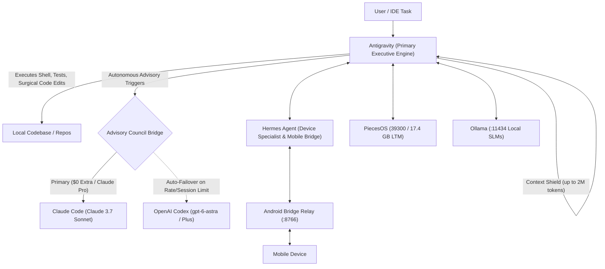

# Autonomous Multi-Agent Triad (Antigravity ↔ Claude Code ↔ OpenAI Codex ↔ Hermes)

> **Autonomous multi-agent collaboration framework with zero incremental API cost, 2M-token context shielding, and automated high-availability advisory failover.**

---

## 1. Overview & Core Philosophy

Instead of relying on fragile single-agent setups or metered API billing frameworks that incur high token costs, the **Autonomous Multi-Agent Triad** links specialized AI systems across your machine into a coordinated triad:



### Strict Zero-Incremental-Cost Policy
- **Antigravity (`agy`):** Native Google IDE & CLI with up to 2,000,000 token context window.
- **Claude Code (`claude`):** Claude Pro flat-rate subscription ($0 extra API fees).
- **OpenAI Codex (`codex`):** ChatGPT Plus subscription via WebSocket OAuth (`gpt-6-astra` / `gpt-5.6-terra`, $0 extra API fees).
- **Hermes Agent (`hermes`):** StepFun 3.7 Flash free portal tier ($0 cost).
- **On-Device Subsystems:** PiecesOS (vector database) & Ollama (local models).

---

## 2. Role Distribution

| Agent / Subsystem | Primary Role | Superpowers |
| :--- | :--- | :--- |
| **Antigravity** | **Executive Engine & Context Shield** | Interactive dev loop, deep repository indexing, test runners, surgical file replacement, shielding Claude/Codex from raw context bloat. |
| **Claude Code** | **Chief Architect & Lead Reviewer** | System architecture, diff reviews, invariant verification, type inference. |
| **OpenAI Codex** | **Advisory Failover Council** | Instant, zero-downtime failover whenever Claude hits its 5-hour rolling session limit. |
| **Hermes Agent** | **Device & Skill Specialist** | Android mobile bridge (port 8766), ADB workflows, background batch tasks via StepFun 3.7 Flash. |
| **PiecesOS & Ollama**| **Local Memory & Offline Inference** | 17.4 GB long-term memory, vector stores, zero-latency local SLM tasks. |

---

## 3. High-Availability Advisory Bridge

When Antigravity or the CLI queries the Advisory Council, the query is routed through `triad_engine.py`:
1. **Zero-Token MCP Stripper:** By running with `empty-mcp.json` and `--ignore-user-config`, 370+ local and remote MCP tools are stripped from the advisory prompt. This cuts token burn from **304k tokens per query down to ~500 tokens (99.8% reduction)**.
2. **Standard Stdin Piping:** Passes prompts via `stdin` to avoid Windows CLI length limits (`lpCommandLine` 32,767 character ceiling).
3. **Automatic Failover:** If Claude Code reports a session limit, rate limit, or network failure, the query automatically re-routes to OpenAI Codex with zero manual intervention.

---

## 4. CLI Commands (Available Globally via `triad`)

The framework exposes a unified CLI on your system `PATH`:

```powershell
# 1. Comprehensive health and $0-billing audit across all platform layers
triad doctor

# 2. Pipes current git diff (or staged/HEAD) to Advisory Council with automatic failover
triad review "Checking changes for new auth middleware"
triad review --cached         # Review only staged changes
triad review --head           # Review last commit (HEAD~1)
triad review --competition    # Run dual-advisor competition mode (Claude + Codex in parallel)

# 3. Consults Advisory Council on architectural dilemmas & schemas
triad consult "Should we use optimistic UI or server-confirmed state for this queue?" --context "schema details"
triad consult --competition "Evaluate SQLite vs IndexedDB for offline queue"

# 4. Diagnoses persistent runtime / compiler errors
triad debug "TypeError: Type 'string | undefined' is not assignable to type 'string'" --context "caller code"
triad debug --competition "Intermittent deadlock in connection pool"

# 5. Full pre-commit verification pipeline with self-healing retry loop
triad gate                    # Runs tsc -> test runners -> diff review
triad gate --max-retries 2    # Auto-applies advisor patches and retries verification loop

# 6. Ephemeral git worktree isolation (Windows-hardened)
triad worktree list           # List active worktrees
triad worktree create         # Create ephemeral worktree for safe experimentation
triad worktree remove <path>  # Remove worktree cleanly
triad worktree prune          # Prune stale worktree metadata

# 7. Model-as-a-Judge benchmark suites ($0 extra token billing)
triad bench --suite handrolled   # Run 16-case planted defect & negative control suite
triad bench --suite swebench     # Run SWE-bench Verified slice (astropy, django, etc.)
triad bench --limit 5 --engine auto
```

---

## 5. Repository Structure

```
autonomous-triad/
├── bin/
│   ├── triad.cmd              # Windows Command Prompt launcher
│   └── triad.ps1              # PowerShell wrapper script
├── triad/
│   ├── __init__.py
│   ├── triad_engine.py        # Core multi-agent orchestrator & health checker
│   ├── advisor_manager.py     # Dynamic config-driven advisor loader & router
│   ├── advisors.json          # Declarative advisor definitions & execution flags
│   ├── competition.py         # Concurrent dual-advisor council & synthesis adjudicator
│   ├── worktree.py            # Windows-hardened git worktree isolation manager
│   ├── empty-mcp.json         # Zero-token MCP configuration
│   ├── bench/                 # Model-as-a-Judge benchmarking harness
│   │   ├── run_bench.py       # Hand-rolled benchmark runner (positive & negative controls)
│   │   ├── swebench_runner.py # SWE-bench Verified runner (git dry-run + test simulation)
│   │   ├── swebench_instances.json # Curated SWE-bench Verified slice
│   │   └── cases/             # 16 test cases (8 planted bugs, 8 negative controls)
│   ├── logs/                  # Council session telemetry (.gitignore)
│   └── tests/                 # Unit test suite (advisors, worktree, competition)
├── skills/
│   └── claude-advisor/        # Antigravity skill definition
│       ├── SKILL.md           # Autonomous agent consultation trigger rules
│       ├── advisor.py         # Subprocess bridge
│       └── empty-mcp.json
├── docs/
│   └── ARCHITECTURE.md        # In-depth architectural specification
├── scripts/
│   ├── install.ps1            # Sets up PATH and junctions to ~/.agents
│   ├── verify.ps1             # Verification test suite
│   └── download_swebench.py   # SWE-bench Verified instance ingestion
├── .gitignore
└── README.md
```

---

## 6. Benchmarking & Verification

### Hand-Rolled Suite (Buried Defects & Negative Controls)
- **16 Total Test Cases:** 8 subtle defects buried inside realistic >40-line diffs, and 8 pristine negative controls (refactors, docstrings, type annotations).
- **Scoring Engine:** Model-as-a-Judge semantic resolution (no brittle keyword matching).
- **Baseline Results:**
  - Defect Catch Rate: **87.5%** (7/8 planted defects caught)
  - False Positive Rate: **12.5%** (1/8 negative controls flagged, down from 75%)

### SWE-bench Verified Slice
- Curated slice of verified real-world issues across `django/django` and `astropy/astropy`.
- Dual-tier resolution verification:
  1. Dry-run git patch validation (`git apply --check`, file matching, hunk validation)
  2. Model-as-a-Judge semantic simulation against gold patch resolution criteria

---

## 7. Installation & Setup

To link this repository to your active user environment:

```powershell
# Run the installation script from this directory
.\scripts\install.ps1

# Verify all platforms and zero-billing constraints
triad doctor
```

