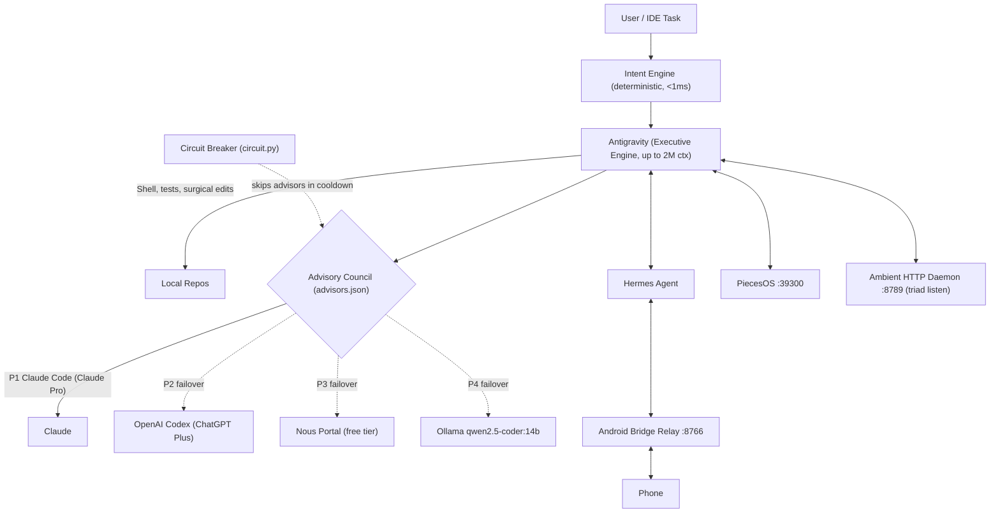

# Autonomous Multi-Agent Triad (Antigravity ↔ Claude Code ↔ OpenAI Codex ↔ Hermes)

> **Autonomous multi-agent collaboration framework with zero incremental API cost, MCP-stripped advisory prompts, circuit-breaker failover, and an adversarial Red/Blue review arena.**

**Status:** v3.3 (2026-10-02) · 292 unit tests passing (1 skipped) · Windows-hardened

---

## 1. Overview & Core Philosophy

Instead of fragile single-agent setups or metered API frameworks, the **Triad** links the AI tools already on your machine into one coordinated system. An **Executive Engine** (Antigravity) does the work; an **Advisory Council** (Claude, Codex, Nous, Ollama) reviews, debugs, and adjudicates; **Hermes** handles device tasks.


```mermaid
flowchart TD
    User["User / IDE Task"] --> I["Intent Engine (deterministic, <1ms)"]
    I --> A["Antigravity (Executive Engine, up to 2M ctx)"]
    A -- "Shell, tests, surgical edits" --> FS["Local Repos"]

    A --> AC{"Advisory Council (advisors.json)"}
    AC -- "P1 Claude Code (Claude Pro)" --> C["Claude"]
    AC -. "P2 failover" .-> CX["OpenAI Codex (ChatGPT Plus)"]
    AC -. "P3 failover" .-> N["Nous Portal (free tier)"]
    AC -. "P4 failover" .-> O["Ollama qwen2.5-coder:14b"]
    CB["Circuit Breaker (circuit.py)"] -. "skips advisors in cooldown" .-> AC

    A <--> H["Hermes Agent"] <--> Relay["Android Bridge Relay :8766"] <--> Phone["Phone"]
    A <--> POS["PiecesOS :39300"]
    A <--> D["Ambient HTTP Daemon :8789 (triad listen)"]
```

### Zero-Incremental-Cost Policy
- **Antigravity (`agy`)** – Google IDE/CLI, up to 2M-token context.
- **Claude Code (`claude`)** – Claude Pro flat-rate subscription.
- **OpenAI Codex (`codex`)** – ChatGPT Plus OAuth, no API metering.
- **Nous Research (`triad/nous_bridge.py`)** – Hermes Portal free-tier models (`stepfun/step-3.7-flash:free`, failover `upstage/solar-pro4:free`).
- **Ollama** – local `qwen2.5-coder:14b`, offline and free.

---

## 2. Role Distribution

| Agent / Subsystem | Role | Notes |
| :--- | :--- | :--- |
| **Antigravity** | Executive Engine & Context Shield | Drives the dev loop, shields advisors from raw build/log bloat. |
| **Claude Code** | Primary advisor (priority 1) | Architecture, diff review, invariant checks. |
| **OpenAI Codex** | Failover advisor (priority 2) | Takes over when Claude hits its rolling session limit. |
| **Nous Portal** | Advisor (priority 3) | Free-tier tertiary advisor / consensus voice. |
| **Ollama** | Offline advisor (priority 4) | Skipped in <1ms when port 11434 is closed. |
| **Hermes Agent** | Device & skill specialist | Android bridge (:8766), ADB workflows, batch tasks. |
| **PiecesOS** | Local memory | Long-term memory store (:39300). |

Advisors are declared in `triad/advisors.json` (binary, flags, priority, input/output mode, readiness port, `enabled`). Entries with `role: "test"` (e.g. `mock`) are excluded from auto-failover unless `TRIAD_ALLOW_MOCK=1`.

---

## 3. High-Availability Advisory Bridge

Every advisory query flows through `triad_engine.py` → `advisor_manager.py`:

1. **Zero-token MCP stripping** – advisors run with `empty-mcp.json` (`--strict-mcp-config`) / `--ignore-user-config`, removing 370+ MCP tool definitions. Token burn per query drops from ~304k to ~500 (~99.8%).
2. **Stdin piping** – prompts go via stdin, avoiding the Windows 32,767-char command-line ceiling.
3. **Persistent circuit breaker** (`circuit.py`) – limit/error/timeout outcomes put an advisor into cooldown (default 30 min for limits) so failover is instant instead of waiting out a 120s timeout. State: `~/.agents/triad/logs/circuit_state.json`. Hardened with stale-result ordering by `call_start_time`, lockless atomic reads, and non-fatal lock timeouts. Clear with `triad doctor --reset-circuits`; disable with `TRIAD_CIRCUIT=0`.
4. **Limit-detection precision** – scans the first ~5 non-empty lines of stdout/stderr so Node deprecation warnings can't mask a real rate-limit message.
5. **Readiness skip** – advisors with a `readiness_port` are skipped immediately if the port is closed.
6. **Mock isolation** – test advisors can never silently rubber-stamp `VERDICT: APPROVED`.

---

## 4. Review Modes

| Mode | Flag | What happens |
| :--- | :--- | :--- |
| Single advisor | *(default)* | First usable advisor by priority, automatic failover. |
| **Competition** | `--competition` | Two advisors run concurrently; a synthesizer adjudicates. Auto-triggered for high-stakes intents (auth, crypto, JWT, RLS, schema migrations, payments, deadlocks). |
| **Adversarial Red/Blue Arena** | `--adversarial` | Blue Team proposes → Red Team attacks → independent referee synthesizes a structured `VERDICT: RESILIENT \| VULNERABLE` (CommonMark-aware parser, safe with nested code fences). |

---

## 5. CLI Commands (global `triad`)

```powershell
# Intent engine: any natural-language prompt is classified and routed
triad "How should I structure this multi-tenant schema?"     # consult
triad "TypeError: Cannot read properties of undefined"       # debug
triad "Check status of all platform layers"                  # doctor
triad "Send SMS to test number via Android bridge"           # Hermes (:8766)
triad "Design JWT auth and RLS migration"                    # high-stakes -> competition
triad auto --competition "<request>"                         # force dual advisor
triad auto --adversarial "<request>"                         # force Red/Blue arena
triad auto --worktree "<request>"                            # run in an isolated worktree

triad doctor [--quick] [--json] [--reset-circuits]           # health + $0-billing audit
triad review [--cached | --head] [--competition | --adversarial] "context"
triad consult [--competition | --adversarial] "question" --context "details"
triad debug   [--competition | --adversarial] "error"   --context "code"
triad gate [--worktree] [--apply-verified] [--max-retries N] # tsc -> tests -> diff review
triad worktree list|create|remove <path>|prune
triad hook install|uninstall|status                          # pre-commit gate
triad listen                                                 # ambient HTTP daemon (alias: serve)
triad bench --suite handrolled|swebench [--limit N] [--engine auto]
```

### Pre-commit hook
`triad hook install` writes `.git/hooks/pre-commit` running `triad gate --worktree --apply-verified` with a sanitized git environment (no index-lock recursion). Any existing hook is preserved as `pre-commit.legacy` and executed first.

### Isolated worktrees
`--worktree` snapshots the working tree (including dirty changes, submodules, dependency links) into an ephemeral git worktree, runs verification and self-healing retries there, and merges only **verified** advisor patches back (`--apply-verified`). Main tree is untouched on failure.

---

## 6. Ambient HTTP Daemon (`triad listen`, port 8789)

Serves `/health`, `/telemetry`, `/auto`, `/review`, `/action/*` to Bear House Hermes Copilot, the Pieces Android companion, and phone push alerts (`notifier.py`).

Hardening: Host-header allow-list (`localhost`, `127.0.0.1`, `::1`), Origin/CORS checks, HMAC timing-safe tokens (`hmac.compare_digest`), mandatory auth on `/telemetry` and `/action/*`, SHA-256 patch hashing from memory before `git apply` (TOCTOU-safe), and a `TRIAD_ALLOWED_REPOS` boundary.

---

## 7. Repository Structure

```
autonomous-triad/
├── bin/                     # triad, triad.cmd, triad.ps1 launchers
├── triad/
│   ├── triad_engine.py      # CLI + orchestrator, gate, hook, doctor
│   ├── intent_engine.py     # Scored deterministic intent classifier
│   ├── advisor_manager.py   # advisors.json loader, routing, limit detection
│   ├── advisors.json        # Declarative advisor definitions
│   ├── circuit.py           # Persistent circuit breaker
│   ├── competition.py       # Dual-advisor council + Red/Blue arena
│   ├── nous_bridge.py       # Nous Portal advisor
│   ├── notifier.py          # Mobile push notifications
│   ├── server.py            # Ambient HTTP daemon
│   ├── worktree.py          # Windows-hardened worktree isolation
│   ├── paths.py / procutil.py
│   ├── empty-mcp.json       # Zero-token MCP config
│   ├── bench/               # Hand-rolled + SWE-bench harness
│   └── tests/               # Unit suite (advisors, circuit, competition, hook, intent, notifier, nous, server, worktree)
├── skills/claude-advisor/   # Antigravity skill (SKILL.md, advisor.py)
├── scripts/                 # install.ps1, verify.ps1, download_swebench.py, prepare_bench_env.py
├── docs/                    # ARCHITECTURE.md, BLUEPRINT.md
├── HERMES_HANDOFF_2026-10-02.md
└── README.md
```

---

## 8. Benchmarking & Verification

- **Hand-rolled suite:** 16 cases (8 buried defects in >40-line diffs, 8 negative controls), scored by Model-as-a-Judge. Baseline: 87.5% defect catch (7/8), 12.5% false positives (1/8).
- **SWE-bench Verified slice:** dry-run `git apply --check` plus semantic judging against gold patches. `scripts/prepare_bench_env.py` probes Docker and publishes `ENV_READY.json` atomically.
- **Unit tests:**
  ```powershell
  python -m unittest discover -s triad/tests
  python triad/triad_engine.py doctor --quick
  ```

---

## 9. Installation

```powershell
.\scripts\install.ps1      # PATH + junctions into ~/.agents
triad doctor               # verify platforms and $0-billing constraints
triad hook install         # optional: gate every commit
```
